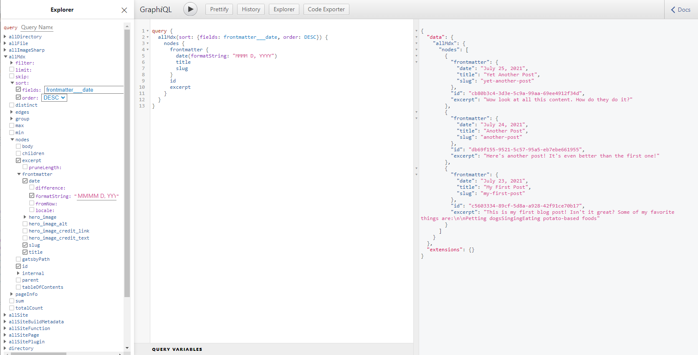

Lors d’un précédent article, je vous avais parlé de la richesse de l’écosystème *React*. Aujourd’hui, je vais vous parler d’un framework React que j’utilise énormément, Gatsby et pourquoi vous devriez aussi l’utiliser dans certains de vos projets web.

Comme vous le savez sûrement, React n’est qu’un outil qui permet au développeur de créer par-dessus leur bibliothèque pour le compléter voir même de créer des frameworks basé sur lui pour avoir des fonctionnalités plus poussées. En gros, React vous fournit le squelette, à vous d’assembler le reste.

Pour ce qui est de **Gatbsy**, c’est un générateur de site statique (SSG). Il est de plus en plus populaire, car il répond à de nombres problème du web moderne. Il vous permet notamment de connecter votre site à un CMS tel que WordPress ou Shopify. Alors voyons voir si Gatsby correspond à vos besoins.

## Le SSG (Générateur de site statique)
C’est la particularité de **Gatsby**, contrairement par exemple à Next.JS qui vous laisse le choix, la génération statique de votre projet est inéluctable si vous optez pour **Gatsby**.
Mais qu’est-ce qu’implique ce choix ?

Premièrement, un site statique est l’opposé d’un site dynamique. A la base, le web n’était recouvert que de site statique, c’est-à-dire des sites qui n’était rien d’autre qu’un tas de fichiers HTML. Mais il a bien fallu aller plus loin, par exemple personnaliser le site en fonction de l’utilisateur…

C’est donc la première chose que vous devez prendre en compte, si un site statique ne correspond pas à vos besoins, tourner vous plutôt vers *NextJS* ou autre.

Mais alors pourquoi choisir un site Statique plutôt qu’un dynamique ?

Le premier argument est la vitesse, en effet, un site statique a l’avantage d’être assez rapide à charger, **Gatsby** a aussi profité de la politique de Google dans le classement des résultats de recherche qui utilise la vitesse du site comme argument.
Ensuite, c’est le coût d’hébergement requis, contrairement à un site dynamique, un site statique ne requiert pas de base de données ni d’une grande quantité de CPU … Parfait donc pour les petits budgets.
Autre argument, la sécurité. Essayer d’hacker un site statique, c’est un peu une perte de temps, il suffit juste de générer à un nouveau le site pour contrer ça. Il n’y a en effet aucune donnée à hacker.

## Connexion avec un CMS
Autre raison pour laquelle **Gatsby** est populaire est la possibilité de connecter un CMS tel que WordPress à votre projet web. Il vous sera alors possible d’intégrer vos articles de blog WordPress à votre site Gatsby.

Sachez qu’il est aussi possible de connecter votre projet **Gatsby** avec d’autres CMS tel que Shopify, Drupal, Netlify … Vous pouvez retrouver une liste des CMS pris en charge par **Gatsby** [ici](https://www.gatsbyjs.com/docs/how-to/sourcing-data/headless-cms/).

Avant de passer à la suite, sachez que Gatbsy utilise *GraphQL* pour récupérer les données de vos CMS, c’est là aussi une des particularités de notre cher framework. Laissez-moi dans la partie suivante vous expliquer son fonctionnement.

## GraphQL
**GraphQL** est un langage de requête crée par Facebook en 2012, il est une alternative au API REST et est fourni par défaut au moment de l’initialisation avec **Gatsby**. L’un des avantages à l’utilisation de cette solution est la flexibilité qu’elle apporte. Vous pouvez par exemple extraire des données de plusieurs sources à l’aide d’un seul appel API ou encore retirer un champ de cette requête sans craindre de perturber les requêtes existantes.

GraphQL et **Gatsby** vous permettent aussi de pouvoir vos requêtes de manière interactive. En effet, si vous lancez votre serveur de développeur et que vous vous rendez à l’url suivante : [http://localhost:8000__graphql](http://localhost:8000__graphql) vous pourrez alors visualiser vos requêtes et les données qu’elles renvoient.

Comme vous l’avez compris, GraphQL est un argument du plus à l’utilisation de **GatsbyJS**, voyons maintenant une dernière raison de l’utiliser.

## Son écosystème
Tout comme React qui, faisant partie de l’écosystème Javascript à son propre écosystème, **GatsbyJS** qui lui fait partie de l’écosystème React, a donc lui aussi son propre écosystème.

Ce qui fait selon moi une bonne technologie est, et cela va de soi, premièrement qu’elle réponde à besoin et qu’ensuite, la communauté suive et soit surtout très active. Et bien sachez que cela est le cas pour notre framework du jour. Vous retrouverez plus de 3 000 plugins développer pour et par la communauté Gatsby. Et pour couronner le tout, vous pouvez tous les retrouvez sur [le site officiel de Gatsby](https://www.gatsbyjs.com/plugins).

Pour conclure cet article, prendre la décision d’utiliser **Gatbsy** n’est pas à prendre à la léger et ne correspondra pas à tout type de projet, mais s’il correspond à votre, mais que je ne vous ai toujours pas convaincu, que dirait de vous apprendre un petit « secret » ? Saviez vous que le site officiel de React utilise… Gatsby !

